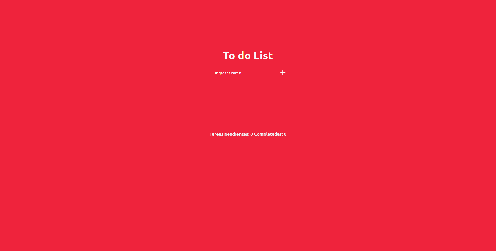
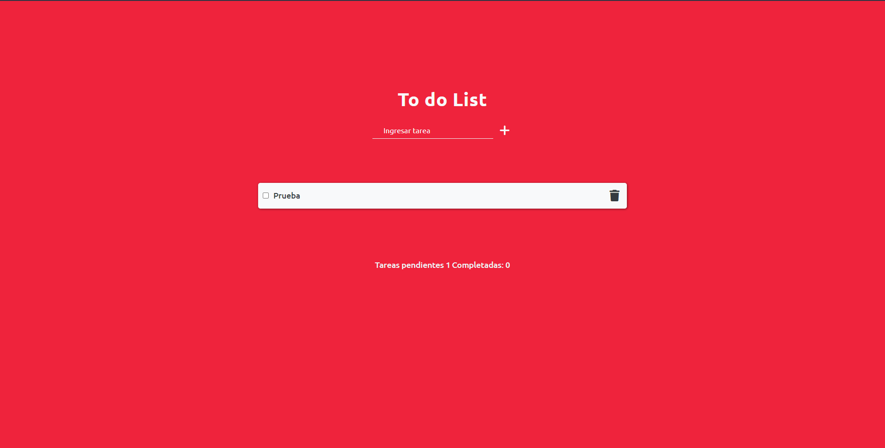
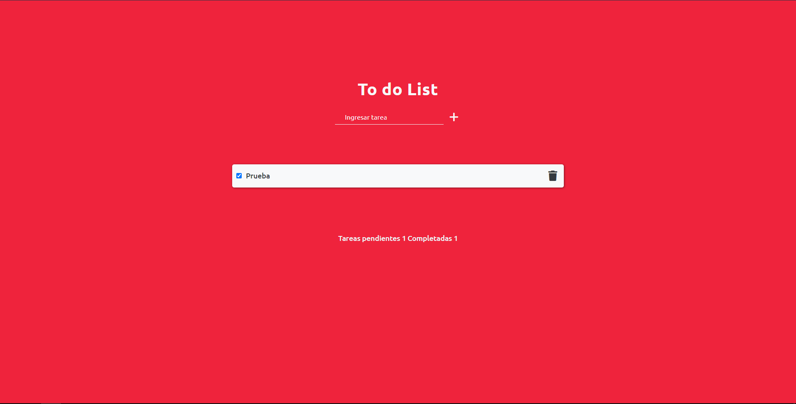

# TO DO LIST

:earth_americas: Primer proyecto majeando el DOM. Es un **To do list** sencillo, 
realizado usando `<HTML>`, `<CSS>` y `<JS>`. Permite agregar tareas, tacharlas y eliminarlas.

## Imágenes :point_down:
---

---

